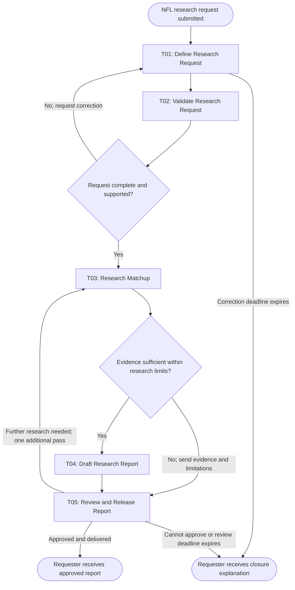

# Workflow of Tasks

## 1. Workflow Goal

This workflow supports the goal in our completed [team charter](PASTE_CHARTER_FILE_URL_HERE).

BetBrief helps adults researching NFL bets gather and evaluate matchup information more efficiently. The workflow produces a report with supporting sources and clearly stated uncertainty, subject to human review before release.

## 2. Workflow Trigger

One run begins when a requester submits an NFL matchup research request containing the teams, game date, and research question.

## 3. Completion Condition at Runtime

A run ends successfully when the requester receives a human-approved research report containing:

- The requested matchup and game date.
- Relevant statistics, injury updates, betting odds, and weather information where applicable.
- Source links and retrieval timestamps.
- An explanation of the evidence, conflicting findings, and uncertainty.
- A record of human approval.

If the request cannot be completed, the run closes with an explanation delivered to the requester and a recorded reason for closure. This is an exception outcome rather than successful report completion.

## 4. General Workflow

The requester defines the research request in T01 Define Research Request. T02 Validate Research Request checks that the required information is present and the request is within the supported NFL research scope. For valid requests, T03 Research Matchup gathers evidence from approved sources, identifies missing or conflicting information, and chooses additional research actions within its tool and time limits. T04 Draft Research Report uses the collected evidence to prepare a structured report. T05 Review and Release Report checks factual support, source relevance, and the explanation of uncertainty before delivering an approved report to the requester. Technical validation failures pause T02 for team coordinator resolution. If unresolved within one business day, the coordinator closes the run and notifies the requester.

If request details are missing or unsupported, T02 returns a correction message to the requester and the workflow pauses at T01. It resumes when the requester supplies corrected details. If no correction arrives within one business day, the run closes and the requester receives a closure explanation.

If a research tool fails, T03 follows the tool's specified retry limit and may use an approved alternative source. If necessary evidence remains unavailable or unresolved when research limits are reached, T03 sends its evidence package and limitation explanation directly to T05. The reviewer receives the request, available evidence, source links, unresolved issues, and any draft report. The workflow pauses while the reviewer decides whether to release the report, request further research, or close the run.

The reviewer may request one additional research pass, which resumes the workflow at T03. If the report still cannot be approved, the run closes with an explanation of its limitations. If the reviewer does not respond within one business day, the run closes and the requester is notified. The system does not present unsupported claims as facts or place bets on the requester's behalf.

## 5. Workflow Diagram

